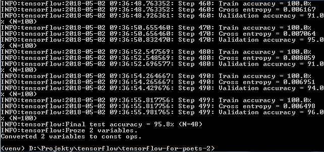

# tensorflow-for-poets-decor

Wykorzystanie Tensorflow for poets z danymi zawartymi na stronie https://www.kaggle.com/olgabelitskaya/traditional-decor-patterns/data.

Poniższe rozwiązanie było testowane na systemie Windows z wersją Pythona 3.6.

Krok 1 - Instalacja wymaganych paczek z pliku requirements.txt.

```
pip install -r requirements.txt
```

Krok 2 - Pobranie Tensorflow for poets ze strony https://github.com/googlecodelabs/tensorflow-for-poets-2.

```
git clone https://github.com/googlecodelabs/tensorflow-for-poets-2
```

Krok 3 - Pobranie danych ze strony https://www.kaggle.com/olgabelitskaya/traditional-decor-patterns/data.

Krok 4 - Wykorzystanie skryptu prepare_data.py do przeniesienia obrazów (wykorzystuje wyłącznie pliki z typem product) do folderów oraz przekonwertowanie z formatu png do jpg.

```
python prepare_data.py
```

Skrypt zawiera 3 zmienne globalne:

- TENSORFLOW_LOCATION - lokalizacja pliku pobranego w kroku 2
- DATA_LOCATION - lokalizacja danych pobranych z kroku 3
- CATEGORY_NAME - nazwa kolumny według której skrypt ma podzielić obrazy na kategorie

Krok 5 - Uczenie

```
cd tensorflow-for-poets-2

python scripts/retrain.py --output_graph=tf_files/retrained_graph.pb --output_labels=tf_files/retrained_labels.txt --image_dir=tf_files/images --how_many_training_steps=500 --architecture=mobilenet_0.50_224
```

Uzyskany wynik 95.8%



Krok 6 - Sprawdzenie wyników dla jednego obrazu

```
python -m scripts.label_image --graph=tf_files/retrained_graph.pb --image="tf_files/images/wycinanki lowickie/02_04_2_002.jpg"
```
